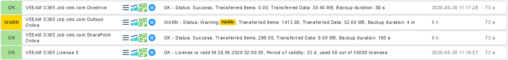

# Checkmk extension for Veeam for Office 365

## Description

This Plugin and check can monitor the Veeam for Office 365 jobs and licenses.

| Checkmk Version | Extension Version |
|-----------------|-------------------|
| Checkmk 2.3.0   | [latest](https://github.com/jiuka/checkmk_veeam_o365/releases/latest) |
| Checkmk 2.2.0   | [2.6.1](https://github.com/jiuka/checkmk_veeam_o365/releases/tag/v2.6.1) |
| Checkmk 2.1.0   | [2.5.1](https://github.com/jiuka/checkmk_veeam_o365/releases/tag/v2.5.1) |
| Checkmk 2.0.0   | [2.5.1](https://github.com/jiuka/checkmk_veeam_o365/releases/tag/v2.5.1) |
| Checkmk 1.      | [1.3](https://github.com/jiuka/checkmk_veeam_o365/releases/tag/v1.3) |

## Screenshots
### Services

### Metrics

## Development

For the best development experience use [VSCode](https://code.visualstudio.com/) with the [Remote Containers](https://marketplace.visualstudio.com/items?itemName=ms-vscode-remote.remote-containers) extension. This maps your workspace into a checkmk docker container giving you access to the python environment and libraries the installed extension has.

## Directories

The following directories in this repo are getting mapped into the Checkmk site.

* `agents`, `checkman`, `checks`, `doc`, `inventory`, `notifications`, `pnp-templates`, `web` are mapped into `local/share/check_mk/`
* `agent_based` is mapped to `local/lib/check_mk/base/plugins/agent_based`
* `nagios_plugins` is mapped to `local/lib/nagios/plugins`

## Continuous integration
### Local

To build the package hit `Crtl`+`Shift`+`B` to execute the build task in VSCode.

`pytest` can be executed from the terminal or the test ui.

### Github Workflow

The provided Github Workflows run `pytest` and `flake8` in the same checkmk docker conatiner as vscode.